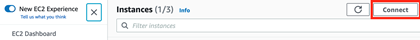
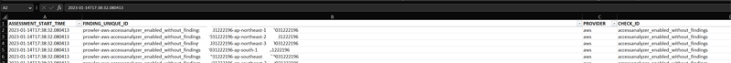
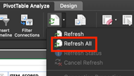
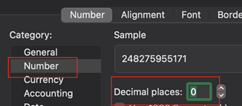

# **Multi-Account Security Assessment via Prowler with Batching and Post Processing**

## **Table of Contents**

1. [Overview](#overview)
2. [Related Resources](#related-resources)
3. [Implementation Procedure](#implementation-procedure)
4. [Output Handling](#output-handling)
5. [Appendix](#appendix)
    - [Script Variables](#script-variables)
    - [Update Components](#update-components)
    - [Resource Estimates](#resource-estimates)
    - [Output Options](#output-options)
    - [Upgrade an existing Prowler V2 deployment to Prowler V3](#upgrade-an-existing-prowler-v2-deployment-to-prowler-v3)
    - [Output Filtering](#output-filtering)
    - [Account Scanning Options](#account-scanning-options)

## **Overview**

Execution of prowler requires deployment of an IAM Role to all accounts being scanned, an IAM Role which the EC2 instance running prowler will utilize, the deployment of an EC2 instance running the prowler software, and an S3 bucket to store the output. This procedure has been validated with prowler versions 3.x

## **Related Resources**

prowler_scan.sh: Bash script used for assessing multiple AWS accounts in parallel. This script is automatically deployed onto the EC2 instance in the folder /usr/local/prowler via the prowler-resources.yaml CFT in user data. By default, this script assumes the IAM role "ProwlerExecRole" in the management account to generate a list of member accounts in the AWS Org. The script then uses this list of accounts to begin an assessment of the accounts. As the accounts are assessed, they will output results in the prowler/outputs directory in CSV and HTML formats. Once all accounts have been assessed, the individual CSV files will be concatenated, duplicate lines removed, and all output files zipped. Note: This script has tunable variables within the script itself (See appendix for more details). This script is provided independently from the CFT for reference.

Prowler-resources.yaml: A CFT template which is deployed in the account where the prowler EC2 instance will be deployed. This template will deploy all necessary dependencies in order for prowler to perform assessments across all accounts. The IAM-ProwlerExecRole is dependent on this template being deployed first. Note: If this stack is deleted and redeployed, the ProwlerExecRole StackSet will need to be re-deployed to rebuild the cross-account dependency between IAM Roles.

IAM-ProwlerExecRole.yaml: A CFT template to be deployed via StackSet across all member accounts. This will create an IAM Role which can be assumed by prowler during scanning.

prowler-report-template.xlsx: An excel document for processing of findings. Pivot tables allow for search capabilities, charts, and consolidated findings. Note: The excel document version must match with a supported version of prowler.

## **Implementation Procedure**

1. Deploy the EC2 instance and supporting resources (prowler-resources.yaml)  
    >Note: When deploying the CFT template, it will provision an IAM Role, S3 Bucket with policy, SNS Topic, and EC2 instance which will be used by Prowler.
    1. Select an account where the Prowler EC2 instance will be provisioned (Security tooling focused AWS account recommended)
    2. Open the CloudFormation console
    3. Create Stack -\> With new resources
    4. Prerequisite - Prepare template: "Template is ready"
    5. Specify template: "Upload a template file" -\> "Choose File" -\> Browse for the template
        - Specify the prowler-resources.yaml template
    6. Next
    7. Specify stack details
        - Stack name: Prowler-Resources
        - Parameters:
            - VPCId: Select a VPC in the account
            - SubnetId: Select a private subnet which has Internet access
                >Note: If a public subnet is selected, the EC2 instance will not provision as the CFT doesn't attach an EIP by default
            - InstanceType: Select an instance size based on the number of parallel assessments. Guidelines: 10=r6i.large, 12=r6i.xlarge, 14-18=r6i.2xlarge
            - InstanceImageId: Leave the default for Amazon Linux 2
            - KeyPairName: Specify the name of an existing KeyPair if using SSH for access (This is optional and can be left blank)
            - PermittedSSHInbound: If using SSH for access, specify a permitted CIDR
            - BucketName: Leave the default unless necessary
            - EmailAddress: Specify an email address for a SNS notification when Prowler completes the assessment and uploads the zip file to S3.
                >Note: The SNS subscription configuration must be confirmed prior to Prowler completing the assessment or a notification will not be sent.
            - IAMProwlerEC2Role: Leave the default unless necessary
            - IAMPRowlerExecRole: Leave the default unless necessary
            - Parallelism: Specify the number of parallel assessments to perform.
                >Note: Specify the proper InstanceType parameter value
    8. Next
    9. Next
    10. Review the summary
    11. Check the box for "The following resource(s) require capabilities: [AWS::IAM::Role]" and Create Stack
    12. Once the Stack has finished deploying, click the Outputs tab in the CloudFormation console and copy the ProwlerEC2Role ARN for use with the next CloudFormation template deploys.

2. Deploy the IAM cross account role to all AWS organization member accounts IAM-ProwlerExecRole.yaml)  
    >Note: The easiest way to do this is to utilize service-managed permissions when deploying the stack and deploying to the entire organization.
    > > This will require trust to be established between CloudFormation and the AWS Organization. If it is not already established, the CloudFormation console for StackSets will present a button which should be clicked and states "Enable trusted access with AWS Organizations to use service-managed permissions." This can be safely enabled (with the appropriate approval) without impacting existing stacks and can also be disabled at a later time via command line.

    1. Open the CloudFormation console
    2. Click StackSets
    3. Click "Create StackSet"
    4. Permissions: Service-managed permissions
    5. Prerequisite - Prepare template: "Template is ready"
    6. Specify template: "Upload a template file" -\> "Choose File" -\> Browse for the template.
        - Specify the IAM-ProwlerExecRole.yaml template.
    7. Next
    8. Specify StackSet details
        - StackSet name: IAM-ProwlerExecRole
        - Parameters:
          - AuthorizedARN: Specify the ProwlerEC2Role ARN which was provisioned as part of the prowler-resources.yaml stack.
          - ProwlerExecRoleName: Leave the default (ProwlerExecRole)
    9. Deployment targets: Leave "Deploy to organization" selected along with defaults
    10. Specify regions: Select a single region as IAM is global. (E.g., Use the region the Prowler EC2 Instance will be deployed in)
    11. OPTIONAL: Specify Deployment Options: Set BOTH "Maximum concurrent accounts" and "Failure tolerance" to a high number (E.g. 100) to have the stacks deploy to this number of AWS accounts simultaneously.
    12. Next
    13. Review the summary
    14. Check the box to approve "I acknowledge that AWS CloudFormation might create IAM resources with custom names."
    15. Submit
        >Monitor the "Stack instances" (Individual account status) and Operations (Overall) tabs to determine when the deploy is completed.

3. Deploy the IAM cross account role to the AWS organization management account (IAM-ProwlerExecRole.yaml)
    >Note: This deployment is direct to the management account as the StackSet deployed previously does not include the management account.
    1. Open the CloudFormation console
    2. Create Stack -\> With new resources
    3. Prerequisite - Prepare template: "Template is ready"
    4. Specify template: "Upload a template file" -\> "Choose File" -\> Browse for the template
       - Specify the IAM-ProwlerExecRole.yaml template
    5. Next
    6. Specify stack details
        - Stack name: IAM-ProwlerExecRole
        - Parameters:
          - AuthorizedARN: Specify the ProwlerEC2Role ARN which was provisioned as part of the Prowler-Resources stack.
          - ProwlerExecRoleName: Leave the default (ProwlerExecRole)
    7. Next
    8. Next
    9. Review the summary
    10. Check the box for "The following resource(s) require capabilities: [AWS::IAM::Role]" and Create Stack

4. Log into the AWS account where the Prowler Resources stack was deployed using SSM Connect and access the ProwlerEC2 Instance.
    >Note: SSM Access is granted as part of the IAM Role which is provisioned and attached to the EC2 instance. If unable to connect, validate the subnet has Internet access and reboot the instance as the agent needs to communicate with the AWS SSM endpoint.  

    

5. Execute the prowler scan script to begin the assessment
    >Notes:
    >
    > > - Screen will be used to allow the prowler script to continue executing if console access is lost.  Wait for the Prowler assessment to complete before continuing with Output handling
    > > - Output from prowler assessments will be redirected to output/stdout-accountId.txt and errors will be shown on the console. tail -f output/stdout-\<accountid\> in the prowler directory to monitor progress of individual account assessments

    ```bash
    sudo -i
    screen
    cd /usr/local/prowler
    ./prowler_scan.sh
    ```

    >Notes:

    - The prowler_scan.sh script is configured to assess all accounts in the AWS organization along with each region within those accounts. The script can be edited manually on the EC2
    instance and variables adjusted to tune the scan for specific use cases. Instructions are contained in the script at the top of the file.
    - Assessments take approx. 5 minutes per AWS account to scan. Depending on the number of resources in the account, this time could be less or more. The bash script assesses multiple accounts in parallel.
    - Optionally once the scan is running, force a screen detach by pressing control-a + d . Screen will detach and you can close the EC2 connection and allow the assessment to proceed
    - The screen process will keep the session running if the connection to the EC2 instance is dropped or detached.
    - To resume a detached session, connect to the instance, sudo -i then screen -r

## **Output Handling**

>Note: The Prowler assessment must already be completed before continuing with this section.  The zip file will be present in the S3 bucket, and if SNS configured, an email delivered.

1. Download prowler_output-\<assessdate\>.zip from the S3 bucket, validate it opens, and then delete the S3 object from the bucket.
    >Note: Having an empty bucket is required for resource removal when the Stack is deleted.

2. Stop the Prowler EC2 instance to prevent billing while the instance is idle.

3. Expand the zip file containing all of the output.
    >Note: The stdout-\<accountid\> files included in the zip can be used for prowler execution review or troubleshooting, but will be not be processed for a report.

4. Prepare the PivotTable Excel Template for environment data  
    Open the "prowler-report-template.xlsx" excel document and select the "Prowler CSV" sheet  
    Delete all sample data including the header. The best option appears to be when an individual cell is selected and then a "Select All" shortcut is used.
    >Note: If asked whether to delete the query associated with the data being removed, click no to prevent problems with the PivotTable.
      - Mac OS: Command+a delete
      - Windows OS: CTRL+a delete

5. Transfer the output from the Prowler assessment into the "prowler-report-template.xlsx" Excel PivotTable template
    - Open the "prowler-fullorgresults-accessdeniedfiltered.txt" (or alternatively prowler-fullorgresults.txt) file with excel
    - Select column A so that the entire column is highlighted and copy this data into the clipboard
    - Open the "prowler-report-template.xlsx" file and click on the "Prowler CSV" sheet
    - Paste the clipboard data into cell A1 so that it populates Column A starting with the header in A1
        - Mac OS: Command+v
        - Windows OS: CTRL+v
    - Instruct Excel to convert the data into columns by delimiting with the semicolon.
        - The pasted data should be selected. However, if not, select column A so that the entire column is highlighted
        - Click the Excel "Data" menu item
        - Click "Text to Columns"
        - Select "Delimited"
        - Next
        - Select "Semicolon" as a delimiter and validate the "Data Preview" shows the data being separated into columns
        - click "Finish"

    >Notes:
    >
    > > - There may be "Access Denied" errors which may their way into the output, these should be deleted from the Prowler CSV data before copying into the template so they don't appear in the findings. A couple options are specified in the Appendix of this document for removing Access Denied errors via command line if necessary.
    > > - It is recommended to use the prowler-fullorgresults-accessdeniedfiltered.txt file which has already been processed to remove the most common errors such as "Access Denied" related to attempted scans on Control Tower resources.

6. Validate that the document contains the assessed environments's data and looks similar to the image below.  

    

7. Refresh Findings and graph pivot tables  
    Select the "Findings" sheet at the bottom of the excel doc, click on A17 (Header of the pivot table) to select the PivotTable header, click "PivotTable Analyze" at the top toolbar, then click the dropdown next to Refresh, and click Refresh All. This will incorporate all new CSV output into the tables and tabs.

    

8. Change the format of the AWS Account numbers to number so they are shown properly  
    Excel doesn't properly display 12-digit AWS account numbers and formats it as an exponential number by default. It is recommended to change the formatting of the column to be number with 0 decimal places.  
    - Right click on column A and select "Format Cells…" This will be present in the findings as well and the same formatting change will be needed correct this.  
    >Note: Excel will remove starting zeros from AWS Account IDs by default.  If an AWS account ID is LESS THAN 12 characters, it begins with 0

    

9. Collapse fields for easier reading of findings (Optional)  
    If you move the mouse to the line between rows 18 and 19 (The space between the critical header and the first finding), the cursor should change to a small arrow pointing down.
    - Click at this point to select all finding fields
    - Right click and locate "Expand/Collapse"
    - Click "Collapse"

10. Creation of a report  
    The findings, severity, and Pass Fail sheets provide details of the assessment. Copy the graphics you wish to use into a presentation document and then delete unneeded Excel sheets. Charts and tables are also included a subdirectory of the zip file, called ResultsVisualizations-<dateOfScan> in PNG format. These can be used to enhance your reports with visualizations.

11. Cleanup the deployment  
    If this Prowler deploy is not going to be utilized for future assessments, clean up the environment by deleting all Stacks and StackSets associated with this deployment.

## **Appendix**

### **Script Variables**

The /usr/local/prowler/prowler_scan.sh script drives the behavior of the Prowler based assessment.  
The default design is to generate a list of all AWS accounts within the AWS Organization and to scan up to 12 at a time including all regions within the account.  
This may not serve every use case and tunable variables have been included at the top of the script to allow for modification of this behavior.

- PARALLELISM: Can be tuned to specify how many accounts to assess simultaneously. The instance size must be adjusted appropriately. r6i.xlarge can sustain 12 parallel assessments.
    >Default Value: r6i.xlarge
- AWSACCOUNT_LIST: Specify the accounts to be assessed using one of the supported methods:
    >Default Value: allaccounts
  - Use the keyword allaccounts to generate a list of all accounts in the AWS Org
  - Use the keyword inputfile to read in AWS Account IDs from a file (If using this mode, must also set AWSACCOUNT_LIST_FILE)
  - Use a space separated list of AWS Account IDs
- AWSACCOUNT_LIST_FILE: If using AWSACCOUNT_LIST="inputfile", specify the path to the file
    >Note: If the file is located in the /use/local/prowler directory, specify the filename, else specify the full path. Account IDs can be specified on one line (space separated) or one Account ID per line
- REGION_LIST: Specify regions (SPACE DELIMITED) if you wish to assess specific AWS regions or leave allregions to include all AWS regions.
    >Default Value: allregions
- IAM_CROSS_ACCOUNT_ROLE: The IAM Role name created for cross account access
    >Default Value: ProwlerExecRole
- ACCOUNTID_WITH_NAME: By default, the value is true, the value of ACCOUNT_NUM column in the final report is populated with Account Name in the format \<AccountId-AccountName\>. Changing the value to false will produce the report with ACCOUNT_NUM=\<AccountId\>.
    >Default Value: true
- S3_BUCKET: The S3 bucket which will be used for Prowler report upload
    >Default Value: N/A - Dynamically generated based on the S3 bucket created via the CFN template
- CONSOLIDATED_REPORT: The name of the output report which does not have any grep filtering performed  
    >Default Value: output/prowler-fullorgresults.txt
    The extension used is .txt, as 'CSV' output is semicolon delimited via Prowler and this makes it easier to work with Excel
- CONSOLIDATED_REPORT_FILTERED: The name of the output report which does have grep filtering performed to remove common errors.  
    >Default Value: output/prowler-fullorgresults-accessdeniedfiltered.txt
    The extension used is .txt, as 'CSV' output is semicolon delimited via Prowler and this makes it easier to work with Excel  
    This file is recommended to be used for reporting as know errors are removed and provide cleaner output  
- The prowler command within the for loop can also be tuned to meet the needs of the assessment.  
    >Default Value: prowler -R arn:aws-partition:iam::$ACCOUNTID:role/$IAM_CROSS_ACCOUNT_ROLE -M csv json -T 43200 --verbose | tee output/stdout-$ACCOUNTID.txt 1>/dev/null

### **Update Components**

Code updates are made to the GitHub repos to add new functionality and correct potential issues.  
In order to pull these updates into an existing deployment, steps are provided below:

- Prowler and dependencies
  - Log into the EC2 Instance and sudo to root: sudo -i
  - Execute pip3 to upgrade the Prowler package: pip3 install --upgrade prowler
- prowler_scan.sh script (While maintaining local script parameter values with git stash)
  - Log into the EC2 Instance and sudo to root: sudo -i
  - Change Directory to the Prowler script: cd /usr/local/prowler
  - Stash all local changes before git pull so they can be merged back in: git stash
  - Pull the latest repo files: git pull
  - Merge stashed local changes back into the latest script: git stash pop
    >Note: Warnings may appear related to any locally generated files (e.g. finding reports) which are not in the GitHub repo.  This is safe to ignore as long as the prowler_scan.sh shows the local stashed changes are merged back in.

### **Resource Estimates**

10 parallel scans with r6i.large ($3/day), 12 parallel scans with r6i.xlarge ($6/day), 14-18 parallel scans with r6i.2xlarge ($12/day).  
Prowler v3 utilizes more memory than CPU and while a swap file has been added as a buffer, total memory of the EC shouldn't be used over 90%.

### **Output Options**

HTML files are output during the Prowler assessment and may be used as an alternative to the CSV. Due to the nature of HTML, they are not concatenated, processed, nor used directly in this procedure, however may be useful for individual account report review.

### **Upgrade an existing Prowler V2 deployment to Prowler V3**

>Note: This section applies only to existing deployments of Prowler which were done with the V2 version of this solution.  
> >With in-place upgrading, the IAM cross account roles will remain intact and won't require to be provisioned.

1. Log into the AWS Account where prowler-resources.yaml was deployed via CloudFormation
2. Open the CloudFormation console
3. Select the Prowler-Resources Stack
    - Click Update
    - Prerequisite - Prepare template
        - Replace current template
        - Upload a template file
            - Select the V3 prowler-resources.yaml file
            - Next
    - Specify stack details
        - SubnetId: Select a NEW private subnet with Internet access so that the EC2 instance is recreated in the new subnet using the Prowler V3 build specs
            >Note: Review which subnet the existing instance is deployed in and select a DIFFERENT subnet for this new deploy.
            > >The previous prowlerec2 instance WILL BE TERMINATED.  
            > >The stock deploy doesn't have anything which needs to be saved, but if there is anything custom, back it up
        - InstanceType: Select r6i.xlarge (r5.xlarge can be used in regions where r6i isn't yet supported)
        - Parallelism: Select 12
    - Next
    - Next
    - Review the summary
    - Check the box for "The following resource(s) require capabilities: [AWS::IAM::Role]" and Create Stack
    - Submit

    >Note: Once the CloudFormation stack is updated, it will take approx 5 minutes for the new EC2.  
    > >It will be possible to log in via SSM Connect, however the build will still be deploying dependencies.  
    > >Once the build is complete, /usr/local/prowler will be accessible.  
    > >If logged in prior to the build completely, it's recommended to log out and log back in to make sure the binary path is properly configured else the script may fail to properly execute

### **Output Filtering**

If the results contain "Access Denied" errors, you will want to remove them from the findings before processing. The errors are typically due to external influencing permissions which blocked Prowler from assessing a particular resource. For example, some checks fail when reviewing Control Tower buckets "Access Denied getting bucket location for aws-controltower-logs-XXXXXXXXXXXX." These error messages should be removed from the consolidated output CSV file and then copied into the excel sheet.  

How to filter results by removing rows which contain a pattern and outputting the results to a new file:

- Linux/Mac:  

    ```bash
    grep -v -i "Access Denied getting bucket" myoutput.csv > myoutput_modified.csv
    ```

- Windows: (PowerShell)  

    ```powershell
    Select-String -Path myoutput.csv -Pattern 'Access Denied getting bucket' -NotMatch > myoutput_modified.csv
    ```

**Multiple patterns can be matched and processed at the same time:**  

- Linux/Mac: (Grep uses an escaped pipe)  

    ```bash
    grep -v -i 'Access Denied getting bucket\|Access Denied Trying to Get' myoutput.csv > myoutput_modified.csv
    ```

- Windows: (PowerShell: Select-String uses a comma)  

    ```powershell
    Select-String -Path myoutput.csv -Pattern 'Access Denied getting bucket', 'Access Denied Trying to Get' -NotMatch > myoutput_modified.csv
    ```

### **Account Scanning Options**

- Single Threaded multi-account scanning:
    >Gather a list of all accounts in the AWS Org and execute Prowler in a loop for all accounts stored in env variable ACCOUNTS_IN_ORGS  
    Note: "aws organizations list-accounts" can only be run in the management account or an AWS account which has been delegated admin (CloudFormation StackSet/IAM Access Analyzer/etc)  

    ```bash
    ACCOUNTS_IN_ORGS=$(aws organizations list-accounts --output text --query 'Accounts[?Status==`ACTIVE`].Id')  
    for accountId in $ACCOUNTS_IN_ORGS; do prowler -R arn:aws-partition:iam::$ACCOUNTID:role/$IAM_CROSS_ACCOUNT_ROLE -M csv json -T 43200 --verbose | tee output/stdout-$ACCOUNTID.txt 1>/dev/null; done  
    ```

- Single threaded scanning on specific accounts:
    >Specify specific accounts to scan: (Manually specify AWS Account ID separated by whitespace) and then execute Prowler in a loop for accounts specified in the ACCOUNTS_TO_SCAN variable

    ```bash
    ACCOUNTS_TO_SCAN="111111111111 22222222222 33333333333"  
    for accountId in $ACCOUNTS_TO_SCAN; do prowler -R arn:aws-partition:iam::$ACCOUNTID:role/$IAM_CROSS_ACCOUNT_ROLE -M csv json -T 43200 --verbose | tee output/stdout-$ACCOUNTID.txt 1>/dev/null; done
    ```
