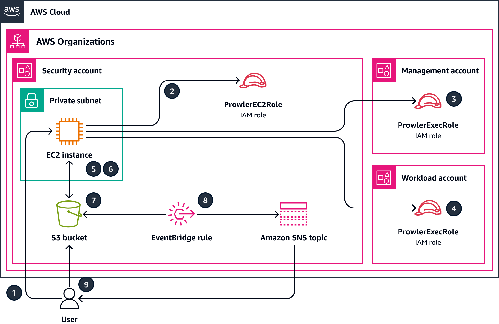

# Create a consolidated report of Prowler security findings from multiple AWS accounts

## Summary

[Prowler](https://github.com/prowler-cloud/prowler) (GitHub) is an open-source command line tool that can help you assess, audit, and monitor your Amazon Web Services (AWS) accounts for adherence to security best practices. In this pattern, you deploy Prowler in a centralized AWS account in your organization, managed by AWS Organizations, and then use Prowler to perform a security assessment of all of the accounts in the organization.

While there are many methods to deploy and utilize Prowler for an assessment, this solution has been designed for rapid deployment, full analysis of all accounts in the organization or defined target accounts, and accessible reporting of the security findings. In this solution, when Prowler completes the security assessment of all accounts in the organization, it consolidates the results. It also filters out any expected error messages, such as errors related to restrictions that prevent Prowler from scanning Amazon Simple Storage Service (Amazon S3) buckets in accounts provisioned through AWS Control Tower. The filtered, consolidated results are reported in a Microsoft Excel template that is included with this pattern. You can use this report to identify potential improvements for the security controls in your organization.

This solution was designed with the following in mind:

- The AWS CloudFormation templates reduce the effort required to deploy the AWS resources in this pattern.
- You can adjust the parameters in the CloudFormation templates and prowler_scan.sh script at the time of deployment to customize the templates for your environment.
- Prowler assessment and reporting speeds are optimized through parallel processing of AWS accounts, aggregated results, consolidated reporting with recommended remediations, and automatically generated visualizations.
- The user doesn’t need to monitor the scan progress. When the assessment is complete, the user is notified through an Amazon Simple Notification Service (Amazon SNS) topic so that they can retrieve the report.
- The report template helps you read and assess only the relevant results for your entire organization.  

## **Deployment steps and supplemental information provided via AWS Prescriptive Guidance (APG)**

[https://docs.aws.amazon.com/prescriptive-guidance/latest/patterns/create-a-consolidated-report-of-prowler-security-findings-from-multiple-aws-accounts.html](https://docs.aws.amazon.com/prescriptive-guidance/latest/patterns/create-a-consolidated-report-of-prowler-security-findings-from-multiple-aws-accounts.html)

​The code in this repository helps you set up the following target architecture:  
​

